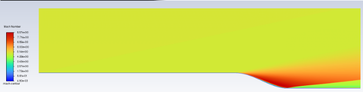
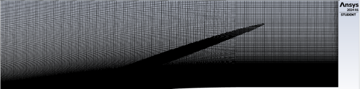
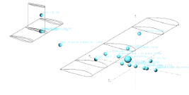
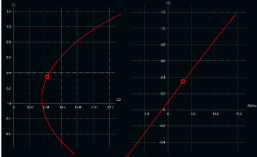
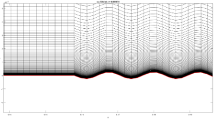
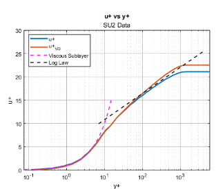
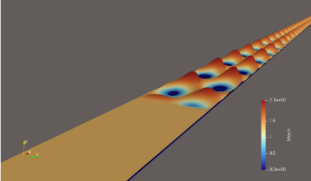

# Nathen Carey

Aeronautical and Astronautical Engineer 

## About Me
I am a recent engineering graduate with both a Bachelors and Masters in Aeronautical and Astronautical Engineering. I have two years of experience working in aircraft and engine performance at a company called JetZero. This cite will display some of my personal projects, papers, and hobby accommplishments. 

BS - 2024 - Purdue University 

MS - 2026 - Purdue University

[Download My Resume](https://github.com/nate9752/nate9752.github.io/raw/main/CareyNathen.Resume.pdf)

## Projects

1. High Speed Flow Over Parameterized Walls
- Meshing, simulation, and post processing done in Ansys FLUENT.
- Worked to match results to a 2024 paper by Nicholson et. al. 
- Simulated supersonic flow over forward and backwards facing walls.

2. Senior Design - Design Build Fly
- Worked alongside a team of engineers to design and build an RC fixed wing aircraft.
- Performed detailed aerodynamic design and stability analysis using XFLR5.
- Aircraft sized using my own sizing code, JZ-Wannabee. After the sucessful flight of our RC aircraft, I continued developing my sizing code into a much larger project (more details in the my "hobbies" section).

3. Reditus Research Assistant
- Utilized Pointwise and SU2 to simulate high speed flow over wavy wall geometries.
- Sought to match flow parameters and boundary layer development to values seen in Jonathan Gaskin's DNS Data.
- Long term research goal was to determine a model for heat flux, as rough geometries don’t intrinsically follow the common assumption that heat flux is aligned with the mean temperature gradient.

## Hobbies 

### Rubix Cube
I've been solving the Rubix Cube since I was in 5th grade. When I started, I used a very standard method that anyone could pick up and use (it literally comes in the box with a normal Rubix Cube brand toy). This beginners method only needed 10-15 algorithms, and I used it for quite a few years. My average always stuck around 40 seconds, and I was pretty happy with this until about halfway through college. I picked up the CFOP algorithm (cross, first 2 layers, orientation, and permutation), and after memorizing around 100 new algorithms, my average dropped to ~27 seconds. Now, I am right around 23 seconds, with an unrecorded personal best of 14 seconds. I've recently started uploading my solves on YouTube. I'll try to upload every week or so, mostly if I'm able to get my average down. 

[Link To My YouTube](https://www.youtube.com/@nate_9752)

I'll also probably end up posting some other types of videos on my channel, maybe some engineering lecture content or some drone flight footage, RC aircraft builds, etc.

### RC Aircraft

### Video Games

